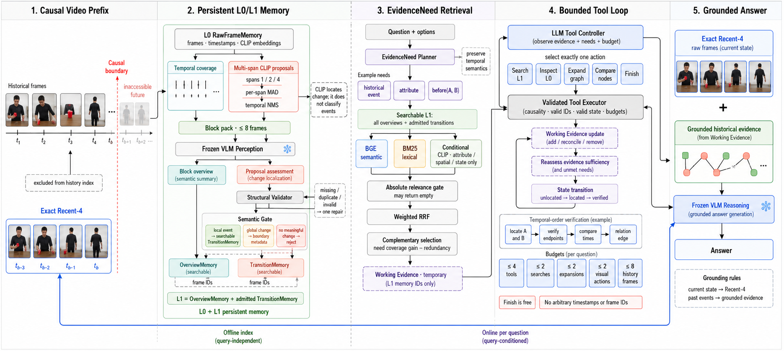
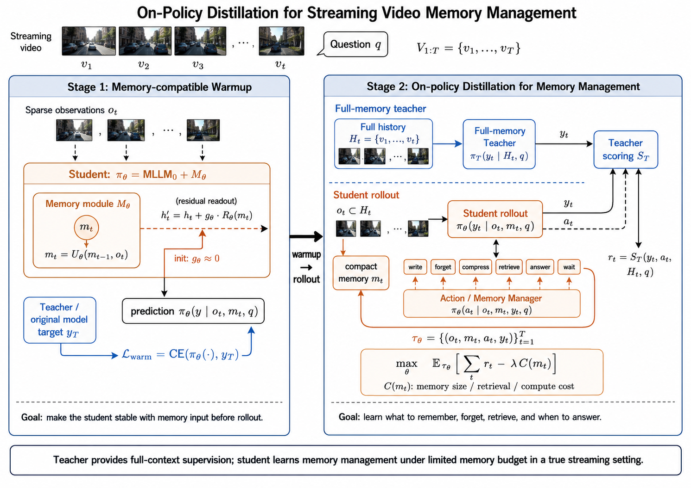

# VeriStream：面向因果长视频理解的自主证据检索智能体

## 摘要

长视频包含的视觉信息远超多模态模型单次上下文容量。均匀增加帧数既会引入大量冗余，又会让久远历史
与当前视觉竞争有限注意力。我们在冻结 Qwen3-VL-8B 上发现：从 Recent4 扩大到 Recent32，Backward
提高 3.43 个百分点，但 Realtime 下降 4.90 个百分点；将历史压缩为 action-fact text memory 并保留
Recent4，则 Backward 提高 8.16 个百分点而 Realtime 仅下降 1.82 个百分点。这表明核心问题不是“放入
更多帧”，而是“按问题获取少量可追溯证据，同时保护当前视觉”。

据此，我们提出 training-free 长视频智能体 VeriStream。系统离线构建视频隔离的两级持久记忆：L0
保存原始帧、时间戳与 CLIP embedding；L1 保存带来源信息的时间块概览和经语义门控的局部事件。这里
的来源信息（provenance）具体指视频 ID、时间区间和对应 L0 原始帧 ID，使语言记忆能够回到其原始视觉
依据。问题到来后，Planner 将问题拆成原子 EvidenceNeed；受约束的 LLM Controller 自主判断当前证据
是否充分，并循环调用 Search、Inspect、Expand、Compare 或 Finish。程序执行器只负责校验因果边界、
memory ID、状态转移与预算，不替模型选择工具。最终模型接收已验证的历史证据与 exact Recent4。

本文在 OVO-Bench 的 Backward 631 题和 Realtime 837 题上评测。相对同基座 Recent4，VeriStream 将
Backward 从 54.04 提高到 58.61，配对 bootstrap 的 95% 置信区间为 $[+2.01,+7.20]$；Realtime 从
81.47 变为 80.00，差值区间跨 0。结果说明受约束的主动检索能够补充长期证据并基本保护当前感知，但
仍低于 Action-fact + Uniform16 的 70.93 BR 平均，表明自主检索与时间关系推理仍是主要瓶颈。

完整方法总览见图 1。

## 1. 问题建模

给定视频 $V=(f_1,\ldots,f_T)$、问题 $q$、选项集合 $o$ 与问题可见时刻 $t_q$，系统只能访问因果
前缀 $V_{\le t_q}$。可用视觉上下文预算为 $B$，而长视频通常满足 $|V_{\le t_q}|\gg B$，因此系统
不可能把全部历史作为原始帧一次性输入模型。本文研究的是在冻结模型参数的条件下，如何组织有限的
视觉上下文和工具调用，而不是如何训练新的长上下文模型。

我们把问题时刻可用信息分为三个互不混淆的状态：

- $C_t$：问题时刻附近的原始当前视觉；
- $M_t$：由 $V_{\le t_q}$ 构建、与具体问题无关的持久视频记忆；
- $E_k$：回答第 $k$ 步已经定位或核验的问题级证据，回答结束后释放。

在问题阶段，Agent 最多执行 $K$ 个有成本动作。第 $k$ 步根据问题、当前证据和剩余预算选择

$$u_k\in\mathcal U=\{\text{Search},\text{Inspect},\text{Expand},\text{Compare},\text{Finish}\},$$

并由受验证的执行器更新 $E_{k+1}=\mathcal T(E_k,u_k,M_t)$。Search 在语言记忆中定位候选；Inspect
通过已定位节点保存的原始帧指针回看局部视觉；Expand 沿已有时间图关系导航；Compare 比较两个已定位
节点；Finish 表示证据已充分或已无有效动作。Finish 不消耗执行预算，其余动作总数不超过 $K$。最终
答案由 $p(a\mid q,o,C_t,E_K)$ 给出。离线索引成本与问题时工具预算分开统计，不能把预计算调用隐藏为
“免费推理”。

这一建模对应三个机制问题：

1. **Memory 内容**：哪些历史信息适合压缩为持久语义记忆，哪些细节必须按需回看原图？
2. **主动感知**：模型如何根据问题选择 Search、Inspect、Expand 或 Compare，而不是无差别增加抽帧？
3. **角色组织**：感知和推理是否解耦，以及解耦产生的压缩损失如何通过原始证据回指和视觉核验弥补？

系统还必须满足：所有操作严格因果；检索可以拒绝所有无关候选；语言证据可以追溯到视频 ID、时间段
和原始帧；不同视频记忆物理隔离；模型调用、工具成本、非法动作和停止原因均可审计。

## 2. 预实验与研究动机

本节不从预设框架反推模块，而是按失败假设逐步收缩设计空间：首先测试“增加最近帧”，随后测试“用
选择器找到历史帧”，再测试“历史帧与当前帧并存”，最后测试“把历史压缩成语言记忆”。每一步实验只
推出下一步设计所必需的结论。

### 2.1 扩大 Recent window：历史覆盖与当前感知存在权衡

我们先复现 SimpleStream 的单轮直接问答：冻结 Qwen3-VL 只接收问题时刻之前的最近帧。该设置没有
Memory 或工具调用，因此可以直接观察视觉窗口长度的影响。为消除早期日志仅解析 A–D 的评分缺陷，
本报告将所有已保存预测统一用当前 A–E 选项解析器重新计分：提取首个独立选项字母（或 1–5 数字映射），
每类任务先计算 accuracy，Backward 与 Realtime 分别对任务宏平均；所有
表格的 `Total (B/R)` 均定义为 $(\text{Backward}+\text{Realtime})/2$，不包含 Forward。

| 模型 | 输入 | Backward | Realtime | Total (B/R) |
| --- | --- | ---: | ---: | ---: |
| Qwen3-VL-2B | Recent4 | 53.67 | 74.23 | 63.95 |
| Qwen3-VL-2B | Recent16 | 54.30 | 72.95 | 63.62 |
| Qwen3-VL-8B | Recent4 | 54.04 | **81.47** | **67.75** |
| Qwen3-VL-8B | Recent8 | 55.37 | 79.59 | 67.48 |
| Qwen3-VL-8B | Recent16 | 55.17 | 77.80 | 66.48 |
| Qwen3-VL-8B | Recent32 | **57.47** | 76.57 | 67.02 |
| Qwen3-VL-8B | Recent64 | 56.37 | 75.62 | 66.00 |

结果不是单调的。8B 从 Recent4 增加到 Recent32 时，Backward 提高 3.43 个百分点，但 Realtime
下降 4.90 个百分点，Total 下降 0.73 个百分点；继续增加到 Recent64 后，Backward 也不再提高。2B
从 Recent4 到 Recent16 同样只获得 0.63 个百分点的 Backward 增益，同时损失 1.28 个百分点的
Realtime。

该实验建立的是**历史覆盖—当前感知权衡**，但没有直接证明其唯一原因是 lost-in-the-middle。观察与
上下文竞争、位置偏置或视觉 token 被冗余帧占用的解释一致，也可能受帧采样位置变化影响。无论具体
机制是哪一种，工程结论相同：继续扩大单一原始视觉窗口不能同时优化两类任务。

**推论 D1：保护当前通道。** 当前视觉应固定为强 Realtime 配置 Recent4；长期历史必须经独立路径
进入，不能通过扩大同一窗口获取。

### 2.2 显式帧选择仍不能解决上下文竞争

接下来测试无需训练的帧选择器。Uniform 追求全局时间覆盖；CLIP-TopK 按问题和单帧的语义相似度
选择候选。先用选择结果替代 Recent window：

| 模型 | 单轮帧输入 | Backward | Realtime | Total (B/R) |
| --- | --- | ---: | ---: | ---: |
| Qwen3-VL-2B | Recent4 | **53.67** | **74.23** | **63.95** |
| Qwen3-VL-2B | Uniform32 | 51.81 | 66.49 | 59.15 |
| Qwen3-VL-2B | CLIP-TopK32 | 49.37 | 66.33 | 57.85 |

Uniform32 和 CLIP-TopK32 不仅没有改善 Backward，还分别损失 7.74 和 7.90 个百分点的 Realtime。
这说明历史帧不能替代精确当前视觉。CLIP 的问题尤其明确：问题—帧外观相似不等价于动作、状态转移
或时间顺序证据。

随后固定 Recent4，再直接追加选择出的历史原始帧：

| 模型 | 单轮帧输入 | Backward | Realtime | Total (B/R) |
| --- | --- | ---: | ---: | ---: |
| Qwen3-VL-8B | Recent4 | 54.04 | **81.47** | **67.75** |
| Qwen3-VL-8B | Recent4 + Uniform28 | 54.19 | 74.28 | 64.24 |
| Qwen3-VL-8B | Recent4 + CLIP-TopK28 | 52.78 | 74.50 | 63.64 |
| Qwen3-VL-2B | Recent4 + CLIP-TopK16 | 52.96 | 69.52 | 61.24 |

保留当前帧仍未解决问题：选出的历史帧继续以长原始序列与 Recent4 竞争，模型还需在一次上下文中自行
建立事件边界和时序。Uniform 有覆盖但不区分信息密度；CLIP-TopK 有表面相关性但缺乏事件语义。

**推论 D2：帧选择器只能定位，不能直接充当最终证据。** 历史首先需要被压缩为更紧凑、带时间边界
的语义单元；原始历史帧只应在问题确实需要视觉细节时局部回读。

### 2.3 文本记忆验证“历史语义压缩 + 当前原始视觉”

为隔离历史表示的作用，我们将历史帧先按 Uniform16 或 CLIP-TopK16 选择，再用同一冻结 Qwen3-VL
生成英文记忆；回答时始终保留 Recent4 原始视觉。比较两种归纳偏置：

- **Action-fact memory** 仅记录直接可见、可定位的主体、动作、对象、位置和顺序，不补全未观察因果；
- **State-aware memory** 进一步归纳动作完成后的持续状态和实体关系，表示更紧凑，但更容易把遗漏动作
  或边界不准传播成错误状态。

例如，直接观察事实可写为 `A person places a red cup on the table and walks away.`；状态归纳则写为
`The red cup remains on the table after the person leaves.`。后者信息密度更高，但“remains”已经包含跨帧
持续性判断。

| 模型 | 历史表示 | 历史选择 | Backward | Realtime | Total (B/R) |
| --- | --- | --- | ---: | ---: | ---: |
| Qwen3-VL-2B | 无记忆（Recent4） | - | 53.67 | 74.23 | 63.95 |
| Qwen3-VL-2B | 无记忆（Recent16） | - | 54.30 | 72.95 | 63.62 |
| Qwen3-VL-2B | Action-fact | Uniform16 | 57.21 | 73.68 | 65.44 |
| Qwen3-VL-2B | Action-fact | CLIP-TopK16 | **57.48** | 73.59 | **65.53** |
| Qwen3-VL-2B | State-aware | Uniform16 | 56.45 | **74.32** | 65.38 |
| Qwen3-VL-2B | State-aware | CLIP-TopK16 | 54.22 | 73.32 | 63.77 |
| Qwen3-VL-8B | 无记忆（Recent4） | - | 54.04 | **81.47** | 67.75 |
| Qwen3-VL-8B | 无记忆（Recent16） | - | 55.17 | 77.80 | 66.48 |
| Qwen3-VL-8B | Action-fact | Uniform16 | **62.20** | 79.65 | **70.93** |
| Qwen3-VL-8B | Action-fact | CLIP-TopK16 | 62.05 | 78.36 | 70.20 |

结果支持三个结论。第一，相对相同数量的原始 Recent16，2B Action-fact + Uniform16 和
CLIP-TopK16 的 Total 分别提高 1.82 和 1.91 个百分点；8B Action-fact + Uniform16 相对 Recent16
提高 4.45 个百分点。历史语言压缩比原始帧堆叠更有效。第二，Action-fact 在两种历史选择下更稳定；
State-aware 在 Uniform 下接近 Action-fact，但在 CLIP-TopK 下下降 1.76 个百分点，说明未经核验的
持续状态并非可靠默认记忆。第三，8B Uniform16 略优于 CLIP-TopK16，说明问题无关的时间覆盖可以比
单帧外观相似更稳健。

**推论 D3：以局部可见事实作为持久语义单元。** L1 应主要保存带明确时间边界的 overview 和
action/state transition，而不是不断累积高层推断状态。

**推论 D4：保留原始证据指针。** 文本压缩不可逆，会遗漏 OCR、颜色、左右关系、小目标和细微状态；
因此语言记忆只作为定位先验，每个节点必须保存视频 ID、时间区间和 L0 frame IDs，以便按需 Inspect
或 Compare。

**推论 D5：Coverage、change proposal 与语义判断必须分工。** Uniform 的稳定性支持用时间覆盖构建
问题无关骨架；但均匀帧可能跨过短动作，因此使用相邻 CLIP embedding 的时间差定位“可能变化的位置”。
早期候选观察同时出现了对象动作、scene cut、camera motion 和近似无变化片段，说明视觉差异峰值不能
直接写成事件事实。因此 CLIP 只生成 before/after proposal；冻结 VLM 再判断它属于局部动作/状态变化、
全局镜头变化还是无意义变化。

### 2.4 从固定文本记忆到主动证据获取

上述文本记忆始终生成固定数量的摘要，无法针对问题决定是否需要 OCR、局部属性、相邻事件或两个时间
端点。题目要求模型自主判断证据充分性，因此自然的下一步是把固定摘要变成可搜索 L1，把 L0 回看和
时间图导航暴露为工具，并维护问题级 Working Evidence。

自由工具控制的预实验 Trace 显示，Planner 有时把过去式改写为 current-only；Controller 会重复 Search、
跳过必要的导航或核验并提前 Finish；纯 Top-K 在全库无关时仍返回候选。这不是“工具无效”，而是说明
自由生成的动作必须受可验证状态约束。

**推论 D6：模型决策与程序约束分工。** LLM 保留 EvidenceNeed 分解、下一工具选择和停止判断；程序
负责保持原始时间语义、绝对相关性拒绝、合法 ID、因果边界、状态前置条件与硬预算。确定性 Controller
只作为消融，不能替代题目要求的自主决策。

### 2.5 视觉变化不等于语义事件

对早期 change proposal 的观察表明，高 CLIP difference 既可能来自“拿起杯子”等局部对象事件，也
可能来自镜头移动、场景切换或光照突变。若把所有变化候选直接写入历史记忆，检索器会把拍摄变化当成
回答证据，污染后续推理。

因此我们在 proposal 和 L1 TransitionMemory 之间加入层级语义判断：局部动作或状态变化可以进入可搜索
证据；scene cut 和 camera motion 只保留为时间导航信息；无意义变化直接拒绝。该设计解决的是“视觉
变化与语义事件不等价”，与生成 token 上限无关。

## 3. VeriStream 方法

上述实验不是独立现象的堆叠，而是对应到一组可追踪的设计决策：

| 实验证据 | 暴露的问题 | VeriStream 对应设计 |
| --- | --- | --- |
| D1：扩大 Recent 损害 Realtime | 历史与当前竞争同一视觉上下文 | exact Recent4 current lane 与历史路径分离 |
| D2：检索帧替换或追加均无效 | 帧相似性不是紧凑回答证据 | L1 语义记忆；原始历史帧不直接批量进入 final QA |
| D3：Action-fact 稳定优于 raw frames | 局部可见事实适合长期压缩 | OverviewMemory 与 TransitionMemory |
| D4：文本不可逆 | OCR、属性、空间细节会在压缩中丢失 | L1→L0 原始证据指针与 Inspect/Compare |
| D5：Uniform 稳定，CLIP 变化又不等于事件 | 需要覆盖、变化定位与语义判断分工 | Coverage-Change Index + Hierarchical Semantic Gate |
| D6：自由 Agent 路由和停止不稳定 | 自主性需要可验证执行边界 | EvidenceNeed、可拒绝检索、LLM Controller + validated executor |

因此，方法的核心不是增加更多检索器或工具，而是建立一条从**问题需求、记忆定位、原图核验到证据
准入**的因果链，并让每个模块都能由对应消融独立证伪。



**图 1：VeriStream 方法总览。** 系统包含因果视频输入、问题无关的 L0/L1 持久记忆、问题条件检索、
自主工具闭环和基于 exact Recent4 与历史证据的最终推理。**生成说明：由于提交时间紧张，本图使用
OpenAI GPT Image 2 辅助绘制。** 使用的绘图提示词保存在
[`docs/veristream/gpt_image2_method_figure_prompt.md`](docs/veristream/gpt_image2_method_figure_prompt.md)。

### 3.1 感知与推理解耦

系统使用相同基座模型形成两个角色，但不共享对话上下文：

- **Perception role** 只观察索引帧或工具回看的原图，输出可见事实及其视频、时间和帧来源；
- **Reasoning role** 进行 EvidenceNeed 规划、工具选择、充分性判断和最终多选回答。

角色可由同一权重实例复用，也可在同一 GPU 加载两个独立实例。独立实例隔离两类 generation 配置和
运行状态，但会近似加倍模型显存；当前实现顺序执行 perception 与 reasoning，因而不能在没有 latency
实验时宣称双实例提高吞吐。`--share-model` 构成显存—隔离性的系统消融。解耦的主要风险是感知摘要
压缩损失，因此所有 L1 节点保留 L0 链接，Inspect 和 Compare 可现场重新感知；最终推理看不到未通过
admission 的文本。

### 3.2 持久记忆与生命周期

系统只有 L0/L1 两级持久 memory：

- **L0 RawFrameMemory**：frame ID、时间戳、原始图像、CLIP embedding、所属 block；
- **L1 OverviewMemory**：12 秒时间块的实体、动作、可见文字与概览；
- **L1 TransitionMemory**：成对 before/after 帧对应的局部动作或状态变化。

Proposal 是构建 TransitionMemory 的临时候选，不是第三层 memory。每条 L1 节点都记录 video ID、时间
范围和 L0 frame IDs。相邻 Overview、父子 Overview-Transition 和相邻 Transition 组成时间证据图。

记忆在视频首次出现或 cache 不兼容时构建；相同视频、相同边界和相同 schema 可复用不变 block。
模型无权把最终答案或其他视频经验写回持久层，从源头抑制确认偏差。问题级 Working Evidence 回答后
立即删除。持久 cache 按 video ID 物理隔离；schema、视频边界、采样率或索引配置不匹配时拒绝加载，
删除视频 cache 即完成显式遗忘。被语义门拒绝的 proposal 只保留审计记录，不进入搜索库。

### 3.3 Coverage-Change Index

每个 12 秒历史 block 均匀保留 4 个 coverage frames，保证静态场景、持续动作和 OCR 不因“变化不大”
而消失。对 CLIP embedding $e_t$，在跨度 $s\in\{1,2,4\}$ 上计算：

$$d_s(t)=1-\cos(e_{t-s},e_t).$$

跨度 1、2、4 分别提供短时突变和较慢状态转移的候选；它们是时间尺度 proposal，不具有动作类别语义。
由于 $d_s$ 的基线和方差随跨度变化，直接比较不同 $s$ 的原始距离会系统性偏向长跨度。令
$\mathcal D_s$ 表示同一局部检测序列中跨度 $s$ 的距离集合。我们先计算稳健中心

$$m_s=\mathrm{median}_{d\in\mathcal D_s}\,d,$$

以及

$$\mathrm{MAD}_s=\mathrm{median}_{d\in\mathcal D_s}|d-m_s|,$$

$$\mathrm{IQR}_s=Q_{0.75}(\mathcal D_s)-Q_{0.25}(\mathcal D_s).$$

为使两种稳健离散度在标准正态参考分布下与标准差处于同一量纲，使用

$$c_{\mathrm{MAD}}=\frac{1}{\Phi^{-1}(0.75)}
=\frac{1}{0.67448975\ldots}=1.482602\ldots,$$

$$c_{\mathrm{IQR}}=\Phi^{-1}(0.75)-\Phi^{-1}(0.25)
=2\Phi^{-1}(0.75)=1.3489795\ldots.$$

因此实现中的两个尺度估计为

$$\hat\sigma_{\mathrm{MAD},s}=1.4826\,\mathrm{MAD}_s,$$

$$\hat\sigma_{\mathrm{IQR},s}=\frac{\mathrm{IQR}_s}{1.349}.$$

这里的 1.4826 和 1.349 不是调参所得：前者是 MAD 的 Gaussian-consistency multiplier，后者是标准
正态分布的理论 IQR。我们没有假设真实 CLIP distance 必须服从高斯分布；该参考分布只用于把不同
robust dispersion 估计转换到可比较尺度。

实际 CLIP distance 在静态片段中可能大量重复，使 MAD 接近 0；若用过小分母会把微小数值噪声放大为
极高 salience。实现采用保守尺度

$$\hat\sigma_s=\max(\hat\sigma_{\mathrm{MAD},s},
\hat\sigma_{\mathrm{IQR},s}),$$

即选择较大的稳健尺度来降低伪峰，而不是声称该 `max` 是统计最优估计。若两者均小于 $10^{-6}$，回退
到 $\max(\mathrm{Std}(\mathcal D_s),10^{-6})$；若某跨度不足 3 个距离样本，则设 $m_s=0$，并以
最小原始变化门槛作为尺度。最终标准化显著性为

$$z_s(t)=\frac{d_s(t)-m_s}{\hat\sigma_s}.$$

对同一 after frame，仅保留 $z_s(t)$ 最大的跨度，避免同一变化被三个尺度重复计数。候选还必须同时
满足：原始距离 $d_s(t)\ge0.05$、标准化显著性 $z_s(t)\ge0.5$、相邻时间位置上的局部极大值；随后执行
最小间隔 2 秒的 temporal NMS，每 block 最多保留 2 个 proposal。原始门槛避免“低方差但变化量几乎
为零”的候选，标准化门槛控制相对局部背景的突出程度，NMS 控制时间冗余。

其中 $0.05$、$0.5$、2 秒和每 block 2 个 proposal 是固定检测超参数，不是由上述正态分位数推导的
理论阈值。我们把 $z\ge0.5$ 设为偏高召回的 proposal 门槛，因为后续还有冻结 VLM semantic gate；
其合理性必须通过 span、normalization、threshold 和 proposal-budget 消融，以及人工标注的 event-level
proposal recall 验证。该设计的优势是把额外视觉成本集中到局部变化候选，同时由 coverage branch 保留
静态信息；它并不保证 CLIP peak 本身就是语义事件。

### 3.4 Hierarchical Semantic Gate

Coverage、proposal pair 与局部上下文去重后组成至多 8 帧的 block pack。Perception role 在一次调用中
联合生成 Overview 及所有 proposal 的 paired assessment，避免每个候选单独调用：

```text
local_semantic_event -> object_action | state_change -> searchable evidence
global_visual_change -> scene_cut | camera_motion    -> boundary metadata
no_meaningful_change                                 -> reject
```

这里的 Semantic Gate **不读取问题、选项或 OVOBench 任务类型**。索引需要被同一视频的不同问题复用，
因此 gate 只能依据 proposal pair 及其局部上下文中直接可见的变化进行判断。冻结的 Perception VLM
首先输出粗粒度 admission 和细粒度 transition type，程序再按下表决定是否写入可检索 evidence：

| VLM admission | 合法细类 | 写入 searchable evidence | 作用 |
| --- | --- | --- | --- |
| `local_semantic_event` | `object_action`, `state_change` | 是 | 供问题阶段检索和视觉核验 |
| `global_visual_change` | `scene_cut`, `camera_motion` | 否 | 保留时间边界与审计信息，不作为回答证据 |
| `no_meaningful_change` | `no_meaningful_change` | 否 | 拒绝冗余变化 |

这里不存在“把 L0 帧移动成 L1”的操作。L0 中的采样帧、时间戳和 CLIP embedding 始终保留；
change proposal 只是引用一对 `before_id/after_id` 的临时候选。Perception VLM 同时看到这对帧、相邻
上下文和 proposal ID，并按照“只描述直接可见变化”的 prompt 输出两个字段：粗类 `admission` 和细类
`type`。例如，物体从桌面进入手中可输出
`local_semantic_event + object_action`；画面整体切换可输出
`global_visual_change + scene_cut`；前后没有可辨认变化则输出
`no_meaningful_change + no_meaningful_change`。所谓“合法细类”只是以下确定性配对约束：

```text
local_semantic_event 只能配 object_action 或 state_change
global_visual_change 只能配 scene_cut 或 camera_motion
no_meaningful_change 只能配 no_meaningful_change
```

Validator 不替 VLM 做语义分类，只拒绝诸如
`local_semantic_event + scene_cut` 这样的非法组合。通过校验后，程序按 admission 执行落库：局部事件
派生一个带 `l0_frame_ids` 的 L1 `TransitionMemory`，并置
`evidence_admissible=true`；全局变化保留为不可检索的 transition/boundary metadata；无意义变化只保留
proposal audit，不生成 TransitionMemory。无论哪种结果，原始 L0 帧都不会被删除。

L1 还包含每个时间块固定生成的 `OverviewMemory`，它不依赖某个 proposal 是否被接纳。因此实际可搜索
集合为

$$
\mathcal M_{\mathrm{search}}
=\mathcal M_{\mathrm{overview}}
\cup\left\{m\in\mathcal M_{\mathrm{transition}}\mid A(m)=1\right\}.
$$

其中 $A(m)$ 是 TransitionMemory 的语义准入指示函数；$A(m)=1$ 对应实现中的
`evidence_admissible=true`。OverviewMemory 无条件属于可搜索集合，全局变化和被拒 proposal 不属于该集合。

Search 只在这个 L1 集合中用 BGE、BM25 和条件 CLIP 排序并返回 `memory_id`，不直接搜索原始 L0 帧。
当 L1 文本不足以回答属性、空间、OCR、状态或时间关系时，Inspect/Compare 再通过该 `memory_id` 保存的
`l0_frame_ids` 读取 L0 原图。因而数据流是“L0 派生 L1 文本索引，L1 定位后按需回到 L0”，而不是
“L0 升级后被 L1 替换”。

索引器还计算 before/after 图像的 RGB 变化强度、变化像素比例和空间集中度，形成
`easy_no_change / easy_global / ambiguous` 视觉先验。由于该先验没有运动补偿，镜头运动可能掩盖局部
动作，因此它目前只用于记录冲突和诊断，**不作为覆盖 VLM 语义判断的硬阈值**。换言之，当前 hard gate
由 VLM 的 admission 决定，而不是由问题属于 Backward、Realtime 或某个证据类型决定。

这里的 **Validator 是确定性的 Python 结构校验器，不是另一个模型，也不负责判断视觉语义是否正确**。
它以本 block 实际生成的 proposal ID 集合和 Perception VLM 返回的 JSON 为输入，逐项检查：每个 ID
恰好出现一次、没有未知或重复 ID、admission 和 transition type 属于允许集合、父类与细类满足上表
层级约束，以及被接纳事件的 `before/change/after` 均非空。只有通过这些检查的 assessment 才能进入
Semantic Gate。若某些 ID 缺失或字段非法，系统把错误类型和缺失 ID 发回同一 Perception VLM，执行
至多一次 targeted structural repair，再用完全相同的规则复检。Repair 只修复 JSON 覆盖和结构一致性，
不能证明事件语义正确；其调用数、恢复数和失败数单独记录，并可用
`--disable-proposal-repair` 做消融。完整链路为：

```text
multi-span CLIP proposal -> Perception VLM assessment -> structural Validator
                         -> Semantic Gate -> searchable evidence / boundary metadata / reject
```

### 3.5 EvidenceNeed 与 Temporal Evidence Graph

Reasoning role 只根据问题和选项生成原子 Need：scope、evidence type、检索描述、实体、动作、时间关系、
优先级与 scope confidence。过去式、before/after、first/last、again 和计数等关键词由程序保留原始时间
语义，不能被 Planner 改写为 current-only。没有关系边且所有 Need 均为高置信 current-only 时，系统
直接使用与 Recent4 baseline 完全相同的帧和 prompt；低于 0.7 的 current scope 扩展为 both。该分数
只是模型自报的**证据范围路由置信度**，不是答案置信度。

我们用 Expected Calibration Error（ECE）离线诊断该分数是否可信；该指标不进入在线推理，也不改变
某道题的工具动作。对问题 $i$，取所有原子 Need 中最小的 scope confidence 作为 $p_i$；Planner 的
原始路由若与数据集提供的粗粒度时间类型一致，则记
$y_i=1$，否则为 0。具体而言，Backward 暂作为“应检索历史”的弱标签，Realtime 暂作为“应保持
current”的弱标签。将 $p_i$ 划分到五个等宽区间
$[0,0.2),[0.2,0.4),\ldots,[0.8,1.0]$ 后，计算

$$
\mathrm{ECE}=\sum_m \frac{|B_m|}{N}
\left|\mathrm{acc}(B_m)-\mathrm{conf}(B_m)\right|,
$$

其中 $\mathrm{acc}(B_m)$ 是该置信区间内路由判断的正确比例，
$\mathrm{conf}(B_m)$ 是平均自报置信度。ECE 越低，表示“自称 0.8 置信”的路由在经验上越接近
80% 正确。审计同时报告历史漏检率、当前误检率和 Recent4 fast-path 覆盖率，并据此检查 0.7 是否为
合理工作点。需要强调，Backward/Realtime 只是 benchmark-level 弱标签，不能刻画每道题的精细证据
需求，因此该 ECE 是 Planner 路由的校准诊断，而不是严格 gold calibration，更不能解释为最终答案的
置信度或准确率。

需要区分 benchmark 的 Backward/Realtime 标签与 Planner 生成的 EvidenceNeed type。前者只用于评测
和上述 ECE 弱监督诊断，在线运行时不会直接控制 gate 或工具。后者由 Planner 根据问题语义分解为
`identity/action/attribute/spatial/state/temporal-order/count` 等类型，并在**问题阶段**影响检索策略：
细粒度外观、空间和状态 Need 可额外启用 question-frame CLIP 相似度，其余 Need 主要依赖文本事实、
实体动作匹配和时间约束。因此，question-time retrieval routing 与 query-independent Semantic Gate 是
两套不同机制。

时间顺序问题拆为两个可独立定位的事件和一条显式关系边：

```text
N1 = observable event A
N2 = observable event B
R1 = before(N1, N2)
```

两端分别召回和核验，再根据 Transition peak time 或不重叠区间判断关系；重叠或缺失保持 uncertain，
不把一个模糊 query 的两个 Top-K 候选强行解释为两件事。

### 3.6 Search：可拒绝的混合召回

Search 面向 L1 节点，而不是按固定帧数搜索。每个 historical/both Need 使用：

- BGE cosine：语义召回；
- BM25：实体、动作和 OCR 词面召回；
- CLIP text-image：仅 attribute、spatial、state 等视觉外观 Need 启用。

候选必须至少满足 BGE $\ge0.25$、BM25 $\ge0.10$ 或条件式 CLIP $\ge0.20$，否则返回空集。门槛后的
候选用 reciprocal rank fusion 合并：

$$R(c,n)=\sum_{r\in\mathcal R_n}\frac{w_r}{10+\mathrm{rank}_r(c)},$$

其中 CLIP 权重为 0.25。RRF 融合各检索器的相对名次，避免直接相加不可比的 cosine 与 BM25 原始值。

为减少重复，候选集合 $S$ 迭代最大化：

$$U(c\mid S)=G(c\mid S)-0.25\max_{s\in S\cup S_{prev}}D(c,s),$$

$$D(c,s)=0.5\,\mathrm{sim}_{\mathrm{text}}+0.25\,\mathrm{sim}_{\mathrm{visual}}
+0.25\,\mathrm{IoU}_{\mathrm{time}}.$$

$G$ 是对尚未覆盖 Need slot 的优先级加权增益。第一条候选没有集合内冗余惩罚，但仍必须通过绝对门槛；
后续候选只在 utility $>0$ 且 metadata budget 可容纳时加入。下一轮 Search 自动排除已见 memory。

### 3.7 自主工具循环

Controller 每轮看到 EvidenceNeed、关系边、Working Evidence、最近工具结果和剩余预算，并只允许输出：

- **SearchMemory**：Need 尚无可靠时间锚点时搜索 L1；
- **ExpandMemory**：已有锚点后沿 before/after/parent/children 图边导航；
- **InspectMemory**：文本缺少属性、空间、状态、OCR 或时间细节时回读 L0；
- **CompareMemory**：两个已定位节点需要顺序、状态、身份或空间比较时联合观察；
- **FinishRetrieval**：重要 Need 已充分覆盖或无有效动作时停止。

模型自主选择上述动作和 Finish。执行器拒绝不存在的 ID、未定位节点上的 Inspect、越过因果边界的帧、
重复越预算动作和非法 schema。默认最多执行 4 次 Search/Inspect/Expand/Compare，其中 Search 不超过
2 轮、图导航不超过 2 次、视觉动作不超过 2 次、历史视觉帧不超过 8；Finish 不计费。`max-tool-actions`
不是“最多只用几条证据”，而是防止循环失控并建立可复现的成本上界。预算耗尽仍未满足时显式记录
unresolved，而不是伪造充分证据。

### 3.8 最终 Evidence Admission

attribute/spatial/state/OCR 和时间图端点必须经过 Inspect 或 Compare；普通历史事件可使用经 semantic
gate、绝对检索门槛和原始证据指针检查后的 L1 text。partial、rejected、unresolved relation 不进入最终
上下文。最终 VLM 同时看到预算内历史证据和 exact Recent4，并以 Recent4 回答当前动作与状态，以历史
证据回答过去事件与顺序。

## 4. 实验设置

### 4.1 数据集与任务构成

选择 OVO-Bench 是因为它在同一因果视频设置中同时包含历史回溯和实时感知，直接对应本文发现的冲突。
主实验只使用 Backward 和 Realtime：

| 维度 | 任务 | 数量 |
| --- | --- | ---: |
| Backward | EPM / HLD / ASI | 297 / 186 / 148 = 631 |
| Realtime | STU / OJR / ATR / FPD / ACR / OCR | 178 / 184 / 116 / 101 / 109 / 149 = 837 |
| 合计 | 9 类 | 1,468 |

每个任务先独立计算准确率；Backward 和 Realtime 分别对其任务宏平均。本文 `BR 平均` 定义为二者算术
平均，不包含 Forward。所有方法采用相同 Qwen3-VL-8B、1 FPS 和因果边界。

### 4.2 主要对照结果

主比较采用设置一致的 Qwen3-VL-8B 结果。Recent4 是无历史记忆的单轮当前视觉基线；两项 Action-fact
方法均保留相同 Recent4，并将 16 个历史采样位置压缩为 text memory，区别仅在历史位置由 Uniform 或
CLIP-TopK 选择。VeriStream 使用本文的 semantic gate、exact Recent4 current lane、确定性证据状态机
和受约束 L0 回看。最新版已完成全部 1,468 题：

| 方法 | Backward | Realtime | BR 平均 | 状态 |
| --- | ---: | ---: | ---: | --- |
| Recent4, single-turn | 54.04 | **81.47** | 67.75 | 已完成 |
| Action-fact + Uniform16 + Recent4 | **62.20** | 79.65 | **70.93** | 已完成 |
| Action-fact + CLIP-TopK16 + Recent4 | 62.05 | 78.36 | 70.20 | 已完成 |
| **Ours: VeriStream** | 58.61 | 80.00 | 69.31 | 已完成 |

相对 Recent4，Uniform16 Action-fact 的 Backward 提高 8.16 个百分点，Realtime 仅下降 1.82 个百分点，
BR 平均提高 3.18 个百分点；CLIP-TopK16 Action-fact 的对应变化为 +8.01、-3.11 和 +2.45 个百分点。
两种选择都说明“历史文本记忆 + 当前原始视觉”优于只增加当前窗口；Uniform16 又比 CLIP-TopK16 高
0.73 个 BR 平均百分点，支持用问题无关 coverage 构建默认历史骨架。

Ours 相对 Recent4 的 Backward 提高 4.57 个百分点，Realtime 下降 1.47 个百分点，BR 平均提高 1.55
个百分点。逐题、按 task 分层的 10,000 次 paired bootstrap 显示，Backward 差值的 95% 置信区间为
$[+2.01,+7.20]$，支持长期证据检索确有增益；Realtime 区间为 $[-3.09,+0.17]$，因此只能说数值略降，
不能宣称存在显著退化。这说明历史检索路径提高了长期理解，同时 exact Recent4 基本保住了当前感知。

Ours 仍比 Action-fact + Uniform16 低 3.59 个 Backward 和 1.62 个 BR 平均百分点；相对
Action-fact + CLIP-TopK16 则低 3.44 和 0.90 个百分点。两项 Backward 差值的 95% 置信区间分别为
$[-6.64,-0.62]$ 与 $[-6.69,-0.08]$，差距不能归因于随机波动。另一方面，Ours 的 Realtime 分别高
0.35 和 1.64 个百分点，区间均跨 0。结论是：当前方法优于无记忆 Recent4，并较好地保护 Realtime，
但尚未超过固定 Action-fact memory 的长期覆盖能力。

### 4.3 消融设计

| 消融组 | 对照设置 | 核心问题 |
| --- | --- | --- |
| 历史表示 | Recent4；Action-fact；L1 text-only；L1+L0 verification | 固定文本记忆、主动检索和原图核验分别贡献多少？ |
| 索引候选 | Coverage-only；Change-only；Coverage+Change | 长程覆盖和局部变化定位是否互补？ |
| Proposal 与语义准入 | span 1；raw spans 1/2/4；MAD-normalized spans；semantic gate on/off | 多尺度标准化和 VLM gate 是否减少长跨度偏置与镜头变化污染？ |
| 检索器 | BGE only；+BM25；+conditional CLIP；absolute gate/utility on-off | 语义、词面和视觉召回何时互补，可拒绝与去冗余是否必要？ |
| 视觉核验 | Search-only；+Inspect；+Inspect+Compare | L1 文本的压缩损失能否通过按需读取 L0 修复？ |
| Agent 控制 | deterministic vs LLM Controller；tool budget 2/4/6 | 自主工具选择的收益、错误和准确率—成本边界是什么？ |
| 时间关系 | composite query vs two atomic Needs + relation edge | 显式时间图是否改善 ASI 的双事件定位与顺序判断？ |

所有消融保持同一模型、问题集合、Recent4 当前通道和评分器，仅改变表中目标模块。主指标报告 Backward、
Realtime 和 BR 平均；同时报告每题模型调用、历史视觉帧和 wall-clock，避免把更高计算量直接解释为方法
收益。主方法与 Recent4、两种 Action-fact 对照使用逐样本、按 task 分层的 paired bootstrap，至少
10,000 次重采样并报告 95% 置信区间；区间跨 0 时不宣称统计显著。

## 5. 局限、风险与未来扩展

### 5.1 当前风险与控制

- **证据保真度**：L1 摘要可能遗漏属性、OCR 和空间细节，也可能把推断误写为事实。系统因此将 L1
  限定为定位先验，保留 L0 frame IDs，并要求视觉 Need 通过 Inspect/Compare 回看原图；最终答案不写回
  持久记忆，不同视频的索引按 video ID 隔离。
- **候选召回与污染的权衡**：CLIP difference 会同时响应对象动作、镜头运动和场景切换；MAD
  normalization 与固定 proposal budget 也可能遗漏弱变化。Coverage branch 保证基础时间覆盖，Semantic
  Gate 过滤非局部事件，absolute relevance gate 允许零召回，但这些机制仍需通过对应消融同时报告准确率、
  候选数量和额外感知成本。
- **Agent 决策不稳定**：Training-free Controller 只依赖 prompt，仍可能误判时间范围、重复调用工具或
  过早 Finish。当前实现用不可改写的时间规则、Need 状态、合法 ID 检查、动作前置条件和硬预算约束执行，
  但这些规则只能阻止非法行为，不能保证模型总能选择最优工具。
- **成本与泛化**：建立索引和回看 L0 会增加模型调用与 wall-clock，现有结论又主要来自 Qwen3-VL 和
  OVO-Bench。因而必须同时报告精度与成本，并在其他基座模型、长视频数据集和问题分布上验证，而不能把
  单一 benchmark 的收益直接解释为普遍结论。

### 5.2 从 Training-Free 到轻量轨迹学习

当前工作刻意保持 Training-free，以单独研究 Memory、工具和角色编排的作用。一个自然扩展是使用更强的
多模态教师模型，例如 GPT 或 Gemini，为训练/开发视频构造结构化长链工具推理轨迹：先分解
EvidenceNeed，再依次记录 `Search/Inspect/Expand/Compare` 动作、对应 observation、证据充分性判断和
Finish 决策。轨迹应保留可核验的工具状态与证据摘要，而不是只蒸馏最终答案或不可验证的自由文本推理。

教师轨迹需经过程序过滤：禁止未来帧和任意时间戳，检查 memory ID 与状态转移，要求结论能够回指实际
证据，并剔除答案错误、重复调用和无依据停止的样本。随后只对 Planner/Controller 进行轻量 SFT 或 LoRA，
保持视觉编码器和 L0/L1 机制不变。该扩展有望让模型学习稳定的“先定位、再核验、证据充分后停止”范式，
减少当前的路由错误、无效工具调用和过早 Finish。它同时引入教师偏差和数据泄漏风险，因此只能使用与
测试集隔离的数据，并应将 Training-free VeriStream 与轨迹微调版本分别报告，不能把后者收益归因于当前
无训练方法。

### 5.3 从人工 Memory 先验到可学习的 Memory Manager

VeriStream 依赖人工设计的 L0/L1、写入规则和工具状态。它便于解释和审计，但并不保证这些先验对所有
视频和问题都是最优的。更一般的问题是：能否让模型在有限 memory budget 下，自己学习什么应写入、
什么可以遗忘、何时压缩或检索，以及何时回答或继续等待？为此，我们提出一个初步的
**On-Policy Distillation（OPD）for Streaming Video Memory Management** 方案，将 memory management
直接视为可学习的序贯决策过程。



**图 2：可学习 Streaming Memory Manager 的初步方案。** Teacher 不使用最近 32 帧，而是在每个时刻
从 $t=0$ 到当前 $t$ 的完整因果前缀中均匀抽取 32 帧。这样视频变长后仍能覆盖早期、中段和当前内容，
为只保留 compact memory 的 Student 提供全局监督。该图为尚未实现的 proposal，由 OpenAI GPT Image 2
辅助绘制，不属于本文 Training-free 实验结果。

**Teacher 与 Student。** 令 $H_t=\{v_1,\ldots,v_t\}$ 表示当前完整历史。Teacher 的实际输入为
$\bar H_t=\mathrm{Uniform32}(H_t)$，并输出 $\pi_T(y_t\mid\bar H_t,q)$。Student 由原始模型
$\mathrm{MLLM}_0$ 和可学习 memory module $M_\theta$ 组成，只接收稀疏观察 $o_t\subset H_t$ 与
当前 compact memory：

$$m_t=U_\theta(m_{t-1},o_t),\qquad
\pi_\theta(y_t\mid o_t,m_t,q).$$

**Stage 1：Memory-compatible Warmup。** Student 初始化时尚未学会使用 memory，直接 rollout 容易破坏
原模型的生成行为。因此采用残差 memory readout

$$h'_t=h_t+g_\theta R_\theta(m_t),\qquad g_\theta\approx0,$$

使 memory module 初始接近 no-op，再用 Teacher 或原模型输出进行短阶段交叉熵 warmup。该阶段只要求
Student 在加入 memory token/state 后仍能稳定回答，不优化具体 memory 策略。

**Stage 2：On-policy Distillation。** Warmup 后，Student 按自身策略在真实视频流中 rollout，产生
$\tau_\theta=\{(o_t,m_t,a_t,y_t)\}_{t=1}^{T}$，其中
$a_t\in\{\text{write, forget, compress, retrieve, answer, wait}\}$。Teacher 使用全前缀均匀视野对 Student
当前 rollout 给出统一监督分数

$$r_t=S_T(y_t,a_t,\bar H_t,q),$$

Student 在自己的状态分布上优化

$$\max_\theta\ \mathbb E_{\tau_\theta}
\left[\sum_t r_t-\lambda C(m_t)\right],$$

其中 $C(m_t)$ 只表示 memory 大小、检索或计算成本。核心区别在于训练样本来自 Student 自己的 rollout，
而不是固定的离线 Teacher 轨迹；Teacher 提供全局监督，Student 则在受限 memory 下学习完整管理策略。
最终希望模型同时学会如何回答，以及记住什么、忘掉什么、何时检索、何时等待和何时回答。

该 proposal 与 5.2 互补：轨迹 SFT 学习执行已有 VeriStream 工具，OPD 则进一步学习 memory management
本身。它目前只是未来方向，不能与本文 Training-free 方法的实验结论混合报告。

## 6. 结论

预实验支持的核心判断是：长视频理解的瓶颈不是抽帧数量本身，而是历史证据与当前视觉竞争，以及“相似
内容”与“可回答证据”之间的差距。VeriStream 因此把当前视觉固定为 exact Recent4，把历史组织为视频
隔离、可追溯、可拒绝的 L0/L1 memory，并让 LLM 在受验证的工具接口上自主决定获取何种证据及何时
停止。全量实验表明，VeriStream 相对同基座 Recent4 将 Backward 提高 4.57 个百分点、BR 平均提高
1.55 个百分点，且 Backward 的 paired-bootstrap 区间不跨 0；Realtime 数值下降 1.47 个百分点，但
区间跨 0。这验证了 training-free 主动历史检索的价值，也表明 exact Recent4 能较好保护当前感知。
与此同时，方法仍低于 Action-fact + Uniform16 的 Backward 和 BR 平均，时间关系任务 ASI、proposal
完成率以及几乎未触发的 L0 比较是明确瓶颈。因此当前结论不是“自主 Agent 全面优于固定记忆”，而是
“主动、可追溯检索优于无历史基线，但其决策与核验策略尚未达到固定 coverage memory 的召回上限”。
进一步地，结构化轨迹 SFT 和 on-policy memory distillation 分别提供了“学习工具推理范式”和“学习
memory policy”两条互补扩展路径，但二者均超出本文 Training-free 设定。
